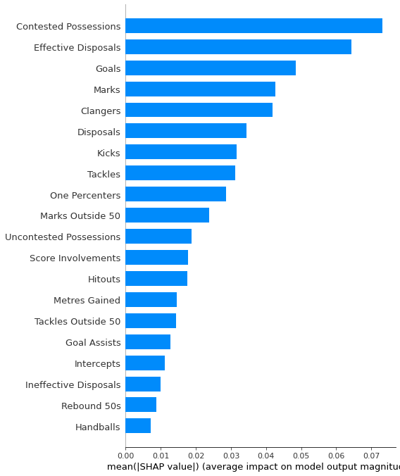

# Machine Learning Prediction of AFL Brownlow Medal
- Author: Lang (Ron) Chen
- Date: Dec 2022 - Feb 2023; New iteration: Aug 2024

# Introduction
This project predicts the Brownlow Medal winner (AFL's highest individual honour) based on statistics of each AFL game. It makes predictions on a game-by-game basis

# App
- To run web application, please open terminal at `./app` and input `export FLASK_APP='Programme.py'` and `flask run` before heading to the link as described printed in the terminal
- First click **scrape data** (may take a moment), followed by **predict**
- You can view game by game prediction by clicking **Game by Game Prediction**

# Method

  

  

1. Data was crawled and scraped from the afltables, and validated by footywire data; data were then stored by game
2. Additional features were generated 
3. Train-Val-Test Split - with 70% of games from 2015-2022 used as training data; 15% used as Val and Test respectively.
4. Features were normalised (x-mean)/sd within each game. This allows comparability between games, and avoids problems such as less gametime in COVID-impacted 2020 season
5. Targets were generated using min-max normalisation of SuperCoach scores (to between 0-1), adjusted such that the Brownlow Vote Getters of the game had the three highest scores, respectively.
6. Many regression models were attempted (tuned to best validation score hyperparameter combination)

    -  *models attempted includes: Linear Regression, Lasso Regression, Ridge Regression, K-Nearest Neighbour Regressor, Random Forest Regressor, AdaBoost Regressor, GradientBoost Regressor, XGB Regressor, LightGBM Regressor, CatBoost Regressor, HistGradientBoost Regressor, Explainable Boosting Machine Regressor, SVM Regressor, NuSVM Regressor, Multilayer Perceptron Regressor, Transformer Regressor* 

Prediction

7. Each game was put through the model to get predicted outputs. 
    - the three players with the highest predicted scores get 3 2 1 predicted votes respectively.
8. Each game's predicted votes are tallied up and the player with the highest predicted vote for the season is the predicted Brownlow Winner

Inference

9. For inference, all available data is used to fit a final model (`./models/retrain_mlp`)

Re-Training

10. The model will be re-trained each year with newest available data. 

11. Retune at users' discretion; but year-by-year backtest demonstrates reasonable robustness in model and hyperparameters.

## Odds Calculation Methodology

1. **Simulate Game Outcomes**: Use predicted scores as the mean and test set errors as the variability (standard deviation) to simulate each game 50,000 times.

2. **Player Performance Distribution**: Determine the chances of key players getting specific vote counts in each game, while considering other players' performances independently.

3. **Season Simulation**: Run 100,000 simulations of the entire season, track the outcomes, and calculate the probabilities based on the average results of these simulations.

# Tuning Results (Validation dataset R2 score)
| Model | Train R2 | Val R2 | Test R2 | 2016-2022 321_score | 2023 321_score |
|-------|--------| ------ | ------ | --------- | --- |
| Random | 0     |   -     |   -     | 0.27 | 0.28 |
| LinR  | 0.865  | 0.865  | 0.866  | - | - |
| Ridge | 0.865  | 0.865  | 0.867  | - | - |
| Lasso | 0.877  | 0.875  | 0.866  | - | - |
| ADA   | 0.721  | 0.717  | 0.721  | - | - |
| KNN   | 1.000  | 0.878  | 0.880  | - | - |
| SVM-r | 0.894  | 0.889  | 0.888  | - | - |
| SVM-p | 0.869  | 0.857  | 0.859  | - | - |
| NSVM-r|  0.892 | 0.886  | 0.887  | - | - |
| NSVM-p| 0.860  | 0.860  | 0.861  | - | - |
| RF    | 0.979  | 0.883  | 0.885  | - | - |
| EXTRF | 0.977  | 0.882  | 0.883  | - | - |
| LGB   | 0.952  | 0.900  | 0.899  | - | - |
| HGB   | 0.915  | 0.894  | 0.895  | - | - |
| EB    | 0.891  | 0.885  | 0.883  | - | - |
| XGB   | 0.939  | 0.897  | 0.897  | 2.78 | 2.32 |
| CBR   | 0.860  | 0.847  | 0.844  | - | - |
| GB    | 0.972  | 0.904  | 0.904  | 3.08 | 2.61 |
| MLP   | 0.908  | 0.906  | 0.906  | 3.18 | 2.63 |
| TF    | 0.893  | 0.893  | 0.893  | 2.9 | 2.29 |
| MLP-AGNN | 0.913 | 0.912 | 0.911 | 3.25| 2.97 |
| TF-AGNN | 0.916 | **0.916** | 0.914 | **3.27** | 2.86 |

*LGB took too long to run year-by-year backtest and thus was left out despite having 4th highest Validation R2*

> Brownlow 321_Score:
> - In each game, add 3/2/1 points if ground truth 3 vote player is predicted with 3/2/1 votes respectively; add 1/2/1 points if ground truth 2 vote player is predicted with 3/2/1 votes respectively; and add 1/0.67/0.33 points if ground truth 1 vote player is predicted with 3/2/1 votes respectively.
> - The Overall 321_Score for each year is the average of 321_scores from each game
> - 321_scores has a minimum of 0 and maximum of 6. 
>   - Roughly indicates how many votes were accurately predicted per game, with an emphasis on getting the 3 votes right.

Year-by-year backtest of TF-AGNN:
| 2015- (Training) | 2016 | 2017 | 2018 | 2019 | 2020 | 2021 | 2022 | (2023) |
| -------- | ---- | ---- | ---- | ---- | ---- | ---- | ---- | ----   |
| 2015 | 3.21 | 3.28 | 2.93 | 3.25 | 2.94 | 3.31 | 2.98 | 2.53 |
| 2016 | | 3.3 | 3.08 | 3.19 | 3.12 | 3.31 | 3.33 | 2.6 |
| 2017 | | | 3.04 | 3.43 | 3.08 | 3.38 | 3.32 | 2.81 |
| 2018 | | | | 3.45 | 3.06 | 3.49 | 3.3 | 2.78|
| 2019 | | | | | 3.2 | 3.59 | 3.33 | 2.84 |
| 2020 | | | | | | 3.37 | 3.36 | 2.84 |
| 2021 | | | | | | | 3.38 | 2.91 |
| 2022 | | | | | | | | 2.86|

# Results

TF-AGNN was the best model by: 
- evaluation 321_score (3.27 / 6), and also:
- validation R2 (0.916 / 1).

It also had:
- test R2 (0.914/1), and:
- OOS [*year 2023*] 321_score (2.86 b / 6).

# Emperical Results

Model trained with 2015-2022 predicted for 2023:
- 1. Nick Daicos, 33 (True 3rd, 28 votes)
- 2. Christian Petracca, 31 (True 6th, 26 votes)
- 3. Rory Laird, 28 (True =15th 20 votes)

- with True 1st (Lachie Neale, 31) predicted =5th with 25 votes

Noting that 2023 was a poor year for prediction overall, we also record the year-by-year backtest (out of sample) prediction for each year from 2016-2022:

- 2016: **Patrick Dangerfield**, 44 (True 1st, 35 votes)

- 2017: Patrick Dangerfield, 40 (True 2nd, 33 votes)

    (True winner Dustin Martin was predicted 2rd with 37 votes; True 36 votes)

- 2018: Brodie Grundy, 41 (True =10th, 17 votes)

    (True winner Tom Mitchell predicted 2nd with 40 votes; True 28 votes)

- 2019: Patrick Dangerfield, 32 (True =6th, 23 votes)

    (True winner Nat Fyfe predicted =3rd with 27 votes; True 33 votes)

- 2020: **Lachie Neale**, 31 (True 1st, 31 votes)

- 2021: Jack Macrae, 37 (True 23rd, 14 votes)

    (True Winner Ollie Wines predicted 3rd, 33 votes; True 36 votes)

- 2022: Lachie Neale, 31 (True =2nd, 28 votes)

    (True Winner Patrick Cripps predicted 5th, 21 votes; True 29 votes)

The model thus demonstrates 2/7 correct predicted first, 6/7 Accuracytop3.

# Future Directions of Work

1. Add Player Position data (Mid, Ruck, Forward, Back) to condition and thus better discriminate the performance scores based on match stats

2. Using disposal/running pattern heatmap as input (Computer Vision) could provide a more dynamic positional representation than a discrete label in point 1

3. Fix model positive bias towards Rucks

4. Update sampling strategy to improve probability estimates

# Bibliography

Data Source

- AFLTables.com. 2022. Brownlow Votes Round by Round. [online] Available at: <https://afltables.com/afl/brownlow/brownlow_idx.html> [Accessed 26 January 2022].

- Footywire.com. 2022. AFL Fixture. [online] Available at: <https://www.footywire.com/afl/footy/ft_match_list> [Accessed 26 January 2022].

# *Appendix*

## *Appendix A: Other models' year-by-year backtest*
**MLP-AGNN**
| 2015- (Training) | 2016 | 2017 | 2018 | 2019 | 2020 | 2021 | 2022 | (2023) |
| -------- | ---- | ---- | ---- | ---- | ---- | ---- | ---- | ----   |
| 2015 | 3.08 | 3.18 | 2.76 | 3.03 | 2.76 | 2.99 | 3.02 | 2.42 |
| 2016 | | 3.4 | 2.95 | 3.35 | 3.12 | 3.23 | 3.16 | 2.59 |
| 2017 | | | 3.06 | 3.4 | 3.2 | 3.34 | 3.25 | 2.67 |
| 2018 | | | | 3.39 | 3.14 | 3.27 | 3.25 | 2.63|
| 2019 | | | | | 3.16 | 3.43 | 3.3 | 2.81 |
| 2020 | | | | | | 3.39 | 3.26 | 2.74 |
| 2021 | | | | | | | 3.27 | 2.73 |
| 2022 | | | | | | | | 2.97|

**MLP**
| 2015- (Training) | 2016 | 2017 | 2018 | 2019 | 2020 | 2021 | 2022 | (2023) |
| -------- | ---- | ---- | ---- | ---- | ---- | ---- | ---- | ----   |
| 2015 | 3.04 | 3.07 | 2.78 | 3.06 | 2.84 | 2.97 | 2.93 | 2.36 |
| 2016 | | 3.28 | 2.88 | 3.27 | 3.11 | 3.16 | 3.15 | 2.53 |
| 2017 | | | 3.00 | 3.41 | 3.18 | 3.26 | 3.24 | 2.6 |
| 2018 | | | | 3.29 | 3.14 | 3.22 | 3.18 | 2.57|
| 2019 | | | | | 3.17 | 3.34 | 3.23 | 2.65 |
| 2020 | | | | | | 3.35 | 3.24 | 2.61 |
| 2021 | | | | | | | 3.17 | 2.59 |
| 2022 | | | | | | | | 2.63|

*Emperical Results (presented as it is the best non-graph model and we intend to perform SHAP on it: see Appendix B)*

Model trained with 2015-2022 predicted for 2023:
- 1. Nick Daicos, 31 (True 3rd, 28 votes)
- 2. Christian Petracca, 29 (True 6th, 26 votes)
- 3. Zak Butters, 28 (True =4th 27 votes)

- with True 1st (Lachie Neale, 31) predicted =10th with 21 votes

Noting that 2023 was a poor year for prediction overall, we also record the year-by-year backtest (out of sample) prediction for each year from 2016-2022:

- 2016: **Patrick Dangerfield**, 35 (True 1st, 35 votes)

- 2017: Patrick Dangerfield, 42 (True 2nd, 33 votes)

    (True winner Dustin Martin was predicted 2rd with 37 votes; True 36 votes)

- 2018: Brodie Grundy, 41 (True =10th, 17 votes)

    (True winner Tom Mitchell predicted 2nd with 39 votes; True 28 votes)

- 2019: Brodie Grundy, 30 (True =6th, 23 votes)

    (True winner Nat Fyfe predicted 4th with 28 votes; True 33 votes)

- 2020: **Lachie Neale**, 30 (True 1st, 31 votes)

- 2021: Jack Steele, 33 (True =5th, 26 votes)

    (True Winner Ollie Wines predicted =3rd, 30 votes; True 36 votes)

- 2022: Clayton Oliver, 33 (True =5th, 25 votes)

    (True Winner Patrick Cripps predicted 7th, 23 votes; True 29 votes)

The model thus demonstrates 2/7 correct predicted first, 6/7 Accuracytop3.

**GBR**
| 2015- (Training) | 2016 | 2017 | 2018 | 2019 | 2020 | 2021 | 2022 | (2023) |
| -------- | ---- | ---- | ---- | ---- | ---- | ---- | ---- | ----   |
| 2015 | 2.99 | 3.11 | 2.7 | 3.01 | 2.64 | 3.06 | 2.69 | 2.37 | 
| 2016 | | 3.21 | 2.87 | 3.08 | 2.78 | 3.15 | 2.9 | 2.5 |
| 2017 | | | 2.87 | 3.11 | 2.8 | 3.25 | 2.97 | 2.46 |
| 2018 | | | | 3.22 | 2.98 | 3.28 | 3.03 | 2.51 |
| 2019 | | | | | 2.9 | 3.26 | 3.16 | 2.52 |
| 2020 | | | | | | 3.2 | 3.09 | 2.48|
| 2021 | | | | | | | 3.17| 2.55|
| 2022 | | | | | | | | 2.61|

**Transformer**
| 2015- (Training) | 2016 | 2017 | 2018 | 2019 | 2020 | 2021 | 2022 | (2023) |
| -------- | ---- | ---- | ---- | ---- | ---- | ---- | ---- | ----   |
| 2015 | 2.81 | 2.88 | 2.56 | 2.87 | 2.59 | 2.75 | 2.58 | 2.18 |
| 2016 | | 2.77 | 2.48 | 2.62 | 2.37 | 2.57 | 2.45| 2.03 |
| 2017 | | | 2.8 | 3.13 | 2.85 | 3.1 | 2.9 | 2.39 |
| 2018 | | | | 3.09 | 2.81 | 3.22 | 2.9 | 2.44 |
| 2019 | | | | | 2.73 | 3.07 | 2.79 | 2.24 |
| 2020 | | | | | | 3.2 | 2.89 | 2.36 |
| 2021 | | | | | | | 2.92 | 2.22 |
| 2022 | | | | | | | | 2.29 |

**XGB**
| 2015- (Training) | 2016 | 2017 | 2018 | 2019 | 2020 | 2021 | 2022 | (2023) |
| -------- | ---- | ---- | ---- | ---- | ---- | ---- | ---- | ----   |
| 2015 | 2.73 | 2,73 | 2.57 | 2.76 | 2.64 | 2.82 | 2.63 | 2.21|
| 2016 | | 2.92 | 2.6 | 2.91 | 2.53 | 2.88 | 2.69 | 2.2 |
| 2017 | | | 2.66 | 2.89 | 2.54 | 2.83 | 2.79 | 2.31 |
| 2018 | | | | 2.9 | 2.63 | 2.7 | 2.74 | 2.27 |
| 2019 | | | | | 2.7 | 2.82 | 2.74 | 2.3 |
| 2020 | | | | | | 2.8 | 2.76 | 2.2 |
| 2021 | | | | | | | 2.85 | 2.27 |
| 2022 | | | | | | | | 2.32 |

**LR**
| 2015- (Training) | 2016 | 2017 | 2018 | 2019 | 2020 | 2021 | 2022 | (2023) |
| -------- | ---- | ---- | ---- | ---- | ---- | ---- | ---- | ----   |
| 2015 | 2.94 | 2.94 | 2.62 | 2.95 | 2.62 | 2.76 | 2.63 | 2.14 |
| 2016 | | 2.98 | 2.61 | 2.94 | 2.63 | 2.79 | 2.65 | 2.16 |
| 2017 | | | 2.61 | 2.91 | 2.62 | 2.8 | 2.66 | 2.15 |
| 2018 | | | | 2.92 | 2.6 | 2.76 | 2.65 | 2.1 |
| 2019 | | | | | 2.61 | 2.76 | 2.65 | 2.11|
| 2020 | | | | | | 2.75 | 2.64 | 2.12 |
| 2021 | | | | | | | 2.63 | 2.12 |
| 2022 | | | | | | | | 2.14 |

**Random**
| 2015- (Training) | 2016 | 2017 | 2018 | 2019 | 2020 | 2021 | 2022 | (2023) |
| -------- | ---- | ---- | ---- | ---- | ---- | ---- | ---- | ----   |
| N/A | 0.3 | 0.28 | 0.31 | 0.24 | 0.28 | 0.25 | 0.2 | 0.28 |

## *Appendix B: Interpretation and feature importance of best non-graph model (MLP)*

  
  

*Assumption: the model has correctly captured the underlying relationship of statistics and Brownlow votes and has low bias.*

***TLDR***

- **Contested Possessions**: Highly rated, confirming the Brownlow as a "Midfielders' award."
- **Disposal Quality (Effective Disposals)**: Next most important feature, aligning with rewarding impactful players; ineffective disposals are also penalised
- **Goal & Marks**: Both top-4 features, allowing forwards and defenders to be contenders.
- **Less clangers**: Aligning with game impact aspect of award
- **Disposals (Contested, Uncontested) & Tackles**: Positive impact on chances of being predicted, emphasizing midfielders' influence.
    - **Kicks vs. Handballs**: Kicks have positive impact, while handballs have negative, indicating umpires don't reward short-handball stat-getters.
- **Tackles & Tackles Outside 50**: Favors midfielders, disadvantaging defending forwards.
- **One-Percenters, Score Involvements, Metres Gained**: Important for match impact, aligning with the Medal's purpose.
- **Marks Inside 50**: Favors forwards
- **Hitouts**: Important but lower, suggesting rucks need more marks and goals to compensate for lower possession numbers.
- **Metres Gained, Intercepts & Rebound 50s**: Surprisingly low importance, which hurts key defenders, particularly those who rely on intercepts (their equivalent of goals) and metres gained for impact.

***Summary***: Contested goal-kicking midfielders who are effective and clean are most advantaged to win the medal; key-backs are worst-off.