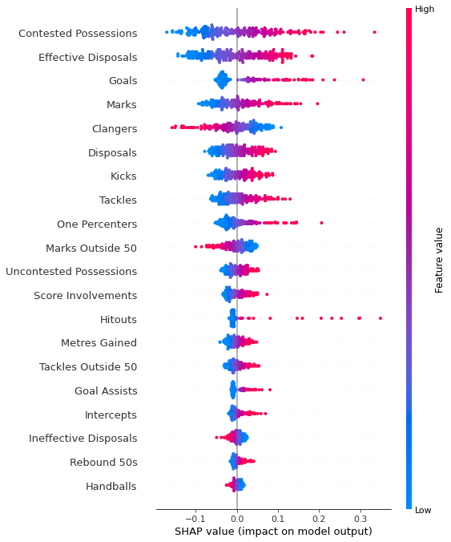

# Machine Learning Prediction of AFL Brownlow Medal
- Author: Lang (Ron) Chen
- Date: Dec 2022 - Feb 2023; New iteration: Aug 2024

# Introduction**
This project predicts the Brownlow Medal winner (AFL's highest individual honour) based on statistics of each AFL game. It makes predictions on a game-by-game basis

# App
- To run web application, please open terminal at `./app` and input `export FLASK_APP='Programme.py'` and `flask run` before heading to the link as described printed in the terminal
- First click **scrape data** (may take a moment), followed by **predict**
- You can view game by game prediction by clicking **Game by Game Prediction**

# Method
1. Data was crawled and scraped from the afltables, and validated by footywire data; data were then stored by game
2. Additional features were generated 
3. Train-Val-Test Split - with 70% of games from 2015-2022 used as training data; 15% used as Val and Test respectively.
4. Features were normalised (x-mean)/sd within each game. This allows comparability between games, and avoids problems such as less gametime in COVID-impacted 2020 season
5. Targets were generated using min-max normalisation of SuperCoach scores (to between 0-1), adjusted such that the Brownlow Vote Getters of the game had the three highest scores, respectively.
6. Many regression models were attempted (tuned to best validation score hyperparameter combination)

    -  *models attempted includes: Linear Regression, Lasso Regression, Ridge Regression, K-Nearest Neighbour Regressor, Random Forest Regressor, AdaBoost Regressor, GradientBoost Regressor, XGB Regressor, LightGBM Regressor, CatBoost Regressor, HistGradientBoost Regressor, Explainable Boosting Machine Regressor, SVM Regressor, NuSVM Regressor, Multilayer Perceptron Regressor, Transformer Regressor* 

Prediction

7. Each game was put through the model to get predicted outputs. 
    - the three players with the highest predicted scores get 3 2 1 predicted votes respectively.
8. Each game's predicted votes are tallied up and the player with the highest predicted vote for the season is the predicted Brownlow Winner

Inference

9. For inference, all available data is used to fit a final model (`./models/retrain_mlp`)

Re-Training

10. The model will be re-trained each year with newest available data. 

11. Retune at users' discretion; but year-by-year backtest demonstrates reasonable robustness in model and hyperparameters.

# Tuning Results (Validation dataset R2 score)
| Model | Train R2 | Val R2 | Test R2 | 2016-2022 321_score | 2023 321_score |
|-------|--------| ------ | ------ | --------- | --- |
| Random | 0     |   -     |   -     | 0.27 | 0.28 |
| LinR  | 0.865  | 0.865  | 0.866  | - | - |
| Ridge | 0.865  | 0.865  | 0.867  | - | - |
| Lasso | 0.877  | 0.875  | 0.866  | - | - |
| ADA   | 0.721  | 0.717  | 0.721  | - | - |
| KNN   | 1.000  | 0.878  | 0.880  | - | - |
| SVM-r | 0.894  | 0.889  | 0.888  | - | - |
| SVM-p | 0.869  | 0.857  | 0.859  | - | - |
| NSVM-r|  0.892 | 0.886  | 0.887  | - | - |
| NSVM-p| 0.860  | 0.860  | 0.861  | - | - |
| RF    |        |        |        | - | - |
| EXTRF | 0.977  | 0.882  | 0.883  | - | - |
| LGB   | 0.952  | 0.900  | 0.899  | - | - |
| HGB   | 0.915  | 0.894  | 0.895  | - | - |
| EB    | 0.891  | 0.885  | 0.883  | - | - |
| XGB   | 0.939  | 0.897  | 0.897  | 2.78 | 2.32 |
| CBR   | 0.860  | 0.847  | 0.844  | - | - |
| GB    | 0.972  | 0.904  | 0.904  | 3.08 | 2.61 |
| MLP   | 0.909  | **0.905**  | 0.905  | **3.11** | 2.57 |
| TF    | 0.903  | 0.903  | 0.903  | 2.81 | 2.42 |

The top 5 validation score models were put through evaluations based on the prediction objective (a Brownlow '321_Score'). Every year from 2016-2022 were used as evaluation set for this score; the model predicting each of these evalution years are trained using all previous years data (see Appendix), and are finally averaged across each year. 

*LGB took too long to run year-by-year backtest and thus was left out despite having 4th highest Validation R2*

> Brownlow 321_Score:
> - In each game, add 3/2/1 points if ground truth 3 vote player is predicted with 3/2/1 votes respectively; add 1/2/1 points if ground truth 2 vote player is predicted with 3/2/1 votes respectively; and add 1/0.67/0.33 points if ground truth 1 vote player is predicted with 3/2/1 votes respectively.
> - The Overall 321_Score for each year is the average of 321_scores from each game
> - 321_scores has a minimum of 0 and maximum of 6. 
>   - Roughly indicates how many votes were accurately predicted per game, with an emphasis on getting the 3 votes right.

Year-by-year backtest of MLP:
| 2015- (Training) | 2016 | 2017 | 2018 | 2019 | 2020 | 2021 | 2022 | (2023) |
| -------- | ---- | ---- | ---- | ---- | ---- | ---- | ---- | ----   |
| 2015 | 3.13 | 3.14 | 2.92 | 3.09 | 3.03 | 3.13 | 3.05 | 2.59 |
| 2016 | | 3.1 | 2.84 | 3.17 | 2.9 | 3.18 | 3.05 | 2.61 |
| 2017 | | | 2.99 | 3.13 | 2.92 | 3.18 | 2.93 | 2.47 |
| 2018 | | | | 3.2 | 3.05 | 3.16 | 3.06 | 2.61|
| 2019 | | | | | 2.9 | 3.28 | 3.2 | 2.56 |
| 2020 | | | | | | 3.31 | 3.31 | 2.68 |
| 2021 | | | | | | | 3.14 | 2.64 |
| 2022 | | | | | | | | 2.57|

# Results
MLP was the best model by: 

- evaluation 321_score (3.11 / 6), and also:
- validation R2 (0.905 / 1).

It also had:
- test R2 (0.905/1), and:
- OOS [*year 2023*] 321_score (2.57 / 6).

# Emperical Results

Model trained with 2015-2022 predicted for 2023:
- 1. Nick Daicos, 29 (True 3rd, 28 votes)
- 2. Christian Petracca, (True 6th, 26 votes)
- 3. Andrew Brayshaw, (True 10 votes)

- with True 1st (Lachie Neale, 13) at 29th.

Noting that 2023 was a poor year for prediction overall, we also record the year-by-year backtest (out of sample) prediction for each year from 2016-2022:

- 2016: **Patrick Dangerfield**, 35 (True 1st, 35 votes)

- 2017: Patrick Dangerfield, 42 (True 2nd, 33 votes)
    
    (True winner Dustin Martin was predicted 3rd with 31 votes; True 36 votes)

- 2018: **Tom Mitchell**, 44 (True 1st, 28 votes)

- 2019: **Nat Fyfe**, 35 (True 1st, 33 votes)

- 2020: **Lachie Neale**, 27 (True 1st, 31 votes)

- 2021: Jack Macrae, 36 (True 23rd, 14 votes)
    (True Winner Ollie Wines predicted 3rd, 33 votes; True 36 votes)

- 2022: Lachie Neale, 33 (True 2nd, 28 votes)
    (True Winner Patrick Cripps predicted 10th, 20 votes; True 29 votes)

The model thus demonstrates 4/8 correct predicted first, 6/8 Accuracytop3.

# Interpretation and feature importance

  
  

*Assumption: the model has correctly captured the underlying relationship of statistics and Brownlow votes and has low bias.*

***TLDR** (Full Analysis in Appendix)*

- **Contested Possessions**: Highly rated, confirming the Brownlow as a "Midfielders' award."
- **Disposal Quality (Effective Disposals)**: Next most important feature, aligning with rewarding impactful players.
- **Marks & Goals**: Top 4 features, allowing forwards and defenders to be contenders.
- **Marks Inside 50**: Favors forwards
- **One-Percenters, Score Involvements, Metres Gained**: Important for match impact, aligning with the Medal's purpose.
- **Disposals (Contested, Uncontested) & Tackles**: Positive impact on chances of being predicted, emphasizing midfielders' influence.
- **Tackles Outside 50**: Favors midfielders, disadvantaging defending forwards.
- **Hitouts**: Important but lower, suggesting rucks need more marks and goals to compensate for lower possession numbers.
- **Metres Gained & Intercepts**: Surprisingly low importance, which hurts key defenders, particularly those who rely on intercepts (their equivalent of goals) and metres gained for impact.
- **Kicks vs. Handballs**: Kicks have positive impact, while handballs have negative, indicating umpires don't reward short-handball stat-getters.
- **Marks vs. Uncontested Marks**: Marks are positive, but uncontested marks are negative, penalizing accumulation through non-impactful play.

# Future Directions of Work
1. Add Player Position data (Mid, Ruck, Forward, Back) to condition and thus better discriminate the performance scores based on match stats

2. Using disposal/running pattern heatmap as input (Computer Vision) could provide a more dynamic positional representation than a discrete label in point 1

# Bibliography

Data Source

- AFLTables.com. 2022. Brownlow Votes Round by Round. [online] Available at: <https://afltables.com/afl/brownlow/brownlow_idx.html> [Accessed 26 January 2022].

- Footywire.com. 2022. AFL Fixture. [online] Available at: <https://www.footywire.com/afl/footy/ft_match_list> [Accessed 26 January 2022].

# *Appendix*

## *Appendix A: Other models' year-by-year backtest*
**GBR**
| 2015- (Training) | 2016 | 2017 | 2018 | 2019 | 2020 | 2021 | 2022 | (2023) |
| -------- | ---- | ---- | ---- | ---- | ---- | ---- | ---- | ----   |
| 2015 | 2.99 | 3.11 | 2.7 | 3.01 | 2.64 | 3.06 | 2.69 | 2.37 | 
| 2016 | | 3.21 | 2.87 | 3.08 | 2.78 | 3.15 | 2.9 | 2.5 |
| 2017 | | | 2.87 | 3.11 | 2.8 | 3.25 | 2.97 | 2.46 |
| 2018 | | | | 3.22 | 2.98 | 3.28 | 3.03 | 2.51 |
| 2019 | | | | | 2.9 | 3.26 | 3.16 | 2.52 |
| 2020 | | | | | | 3.2 | 3.09 | 2.48|
| 2021 | | | | | | | 3.17| 2.55|
| 2022 | | | | | | | | 2.61|

**Transformer**
| 2015- (Training) | 2016 | 2017 | 2018 | 2019 | 2020 | 2021 | 2022 | (2023) |
| -------- | ---- | ---- | ---- | ---- | ---- | ---- | ---- | ----   |
| 2015 | 2.71 | 2.84 | 2.5 | 2.73 | 2.62 | 2.84 | 2.47 | 2.2 |
| 2016 | | 2.9 | 2.58 | 2.9 | 2.62 | 2.85 | 2.52| 2.19 |
| 2017 | | | 2.61 | 2.94 | 2.72 | 2.94 | 2.66 | 2.29 |
| 2018 | | | | 2.97 | 2.8 | 3.0 | 2.77 | 2.35 |
| 2019 | | | | | 2.68 | 2.82 | 2.76 | 2.24 |
| 2020 | | | | | | 2.95 | 2.86 | 2.36 |
| 2021 | | | | | | | 2.84 | 2.38 |
| 2022 | | | | | | | | 2.42 |

**XGB**
| 2015- (Training) | 2016 | 2017 | 2018 | 2019 | 2020 | 2021 | 2022 | (2023) |
| -------- | ---- | ---- | ---- | ---- | ---- | ---- | ---- | ----   |
| 2015 | 2.73 | 2,73 | 2.57 | 2.76 | 2.64 | 2.82 | 2.63 | 2.21|
| 2016 | | 2.92 | 2.6 | 2.91 | 2.53 | 2.88 | 2.69 | 2.2 |
| 2017 | | | 2.66 | 2.89 | 2.54 | 2.83 | 2.79 | 2.31 |
| 2018 | | | | 2.9 | 2.63 | 2.7 | 2.74 | 2.27 |
| 2019 | | | | | 2.7 | 2.82 | 2.74 | 2.3 |
| 2020 | | | | | | 2.8 | 2.76 | 2.2 |
| 2021 | | | | | | | 2.85 | 2.27 |
| 2022 | | | | | | | | 2.32 |

**LR**
| 2015- (Training) | 2016 | 2017 | 2018 | 2019 | 2020 | 2021 | 2022 | (2023) |
| -------- | ---- | ---- | ---- | ---- | ---- | ---- | ---- | ----   |
| 2015 | 2.94 | 2.94 | 2.62 | 2.95 | 2.62 | 2.76 | 2.63 | 2.14 |
| 2016 | | 2.98 | 2.61 | 2.94 | 2.63 | 2.79 | 2.65 | 2.16 |
| 2017 | | | 2.61 | 2.91 | 2.62 | 2.8 | 2.66 | 2.15 |
| 2018 | | | | 2.92 | 2.6 | 2.76 | 2.65 | 2.1 |
| 2019 | | | | | 2.61 | 2.76 | 2.65 | 2.11|
| 2020 | | | | | | 2.75 | 2.64 | 2.12 |
| 2021 | | | | | | | 2.63 | 2.12 |
| 2022 | | | | | | | | 2.14 |

**Random**
| 2015- (Training) | 2016 | 2017 | 2018 | 2019 | 2020 | 2021 | 2022 | (2023) |
| -------- | ---- | ---- | ---- | ---- | ---- | ---- | ---- | ----   |
| N/A | 0.3 | 0.28 | 0.31 | 0.24 | 0.28 | 0.25 | 0.2 | 0.28 |

## *Appendix B: Full Analysis*

The model rates contested posessions most highly - confirming the common intuition that the Brownlow is a "Midfielders' award"; the next most important feature is their disposal quality (measured by effective disposals), which matches the Brownlow Medal's purpose of rewarding the games' most impactful players. Subsequently, marks (posession control aligns with match impact), goals (scoreboard impact aligns with match impact), low clangers (match impact), disposals (favours midfielders and half-backs), tackles are most important features for getting votes. Marks and Goals being top 4 features enable forwards and defenders (general and rebounding defenders in particular because disposals are also ranked highly) to be in the race for the award.

Marks inside 50 being the next most important stat favours forwards, while one-percenters, score involvements and metres gained once again aligns with the Medal's purpose of game impact. 

The fact that all of contested posesions, disposals and uncontested disposals have positive impact on chances of being predicted epitomises how it is a midfielders' game; same goes for tackles outside 50 which favours midfielders and disadvantages defending forwards.

Hitouts' existence - albeit lower in the pecking order - suggests rucks as the 'rare breed' in the game are still given adequate oppotunity to win the award, but they will need more marks and goals to make up for their lower posession numbers compared to midfielders.

Surprisingly, metres gained and intercepts are not rated highly, which hurts the oppotunity for rebounding and intercepting defenders who don't pick up lots of disposals to be rewarded with votes. Key backs are also worst done by as the only important feature/stat which they can rack up on are Marks, with Intercepts (their equivalent of Goals) having low importance making them much more disadvantaged than their Key forward counterparts.

In a breakdown of disposals, kicks have a positive impact while handballs have negative, suggesting umpires generally don't reward the short-handball stat-getters. The logic is similar with Marks being positive but uncontested marks being negative, thus penalising accumulation of mark stats through horizontal or backward passes in the defensive half.